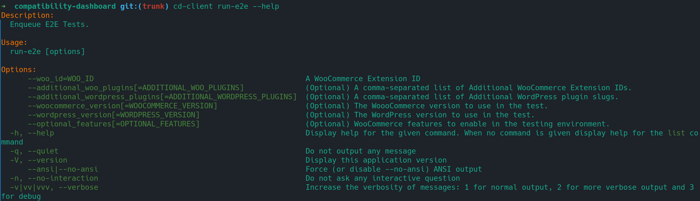

[](https://github.com/woocommerce/qit-cli/actions/workflows/code-tests.yml)

<p align="center"></p>

Welcome to the [Quality Insights Toolkit (QIT)](#). This is a CLI tool to run managed tests against extensions available in the [WooCommerce Extensions Store](https://woocommerce.com/products/).

The supported tests are:

- [WooCommerce E2E Test](./docs/test-types/e2e.md)
- [Activation Test](./docs/test-types/activation.md)
- [Security Test](./docs/test-types/security.md)
- [Compatibility Test](./docs/test-types/compatibility.md)
- [PHPStan Test](./docs/test-types/phpstan.md)
- Performance Test _(Coming Soon)_
- PHP Minimum Version Test _(Coming Soon)_
- WooCommerce API Test _(Coming Soon)_

Have a suggestion for a new test? Feel free to open an issue!

## Who is this for?

This tool is for [WooCommerce Partner developers](https://woocommerce.com/partners/) that have extensions in the [WooCommerce Extension Store](https://woocommerce.com/products).

## Installing

This tool requires **PHP 7.2.5** or higher, and a Unix environment (Linux, Mac, Windows WSL). Support for native Windows is limited.

### Composer

Composer is the recommended approach. This project has zero dependencies.

_Since this repository is still private, a simple `composer require` is not available for now._

1. Place this in your `composer.json`.

```json
{
  "require-dev": {
    "woocommerce/qit-cli": "dev-trunk"
  },
  "repositories": [
    {
      "type": "vcs",
      "url": "git@github.com:woocommerce/qit-cli.git"
    }
  ]
}
```

2. Run `composer update`. It might prompt you for a GitHub Personal Access Token.
3. Run `./vendor/bin/qit partner:add` to configure your credentials.

### Phar

1. Download the [qit](https://github.com/woocommerce/qit-cli/releases/latest/) phar directly from the latest release.\*
2. Make it executable: `chmod +x qit.phar`
3. Move the binary to a directory in PATH, giving preference for a directory that doesn't require root: `(test -w ~/.local/bin && echo $PATH | grep -q "/.local/bin") && mv qit.phar ~/.local/bin/qit || sudo mv qit.phar /usr/local/bin/qit`
4. Run `qit init-a8c` to configure your credentials.

_\* Since this is a private repo, downloading with `curl` or `wget`, like WP-CLI, won't work._

## Running Tests

Tests can be executed against plugins that are available for sale in the WooCommerce Extension Store. Once started, they will run in the cloud, in our servers.

The commands to run tests are formatted as `run-<test-type>`. Example: `./vendor/bin/qit run-e2e --help`



In the example above, we can see that it takes a WooCommerce Extension ID or Slug as a required argument, and many others optional parameters.

You can run just `./vendor/bin/qit` to see a list of available commands.

### Examples:

`./vendor/bin/qit run-e2e some-extension`

This will run the [WooCommerce Core E2E Test Suite](https://github.com/woocommerce/woocommerce/tree/trunk/plugins/woocommerce/tests/e2e-pw) against the WooCommerce extension with slug "some-extension" in our managed servers, using the latest stable versions of WordPress and WooCommerce. Since the tests are executed in the cloud, you can even close the terminal if you wish. You can see the result of this test after a while running `./vendor/bin/qit list-tests`, or `./vendor/bin/qit get 456`, where 456 is the test run ID. When the test finishes, the status will be updated to Success, Warning, or Failed.

`./vendor/bin/qit run-activation some-extension --woocommerce_version=7.0.0-rc.2 --wordpress_version=6.0.1`

In this example, we are running an Activation Test against "some-extension", using a release candidate version of WooCommerce and a specific WordPress version.

## Seeing test runs and their results

- Run `./vendor/bin/qit list` to see a list of test runs.
- Run `./vendor/bin/qit get 456` to get more details about a specific test run, where 456 is the test run ID.

## Running a test for a development version of an extension

To run a test against a development version of an extension, use the `--zip=<ZIP_FILE>` parameter, where `ZIP_FILE` is the path to the zip file containing your extension. This zip file will be installed in the test WordPress site, so make sure that it is a valid plugin.

Example:

`././vendor/bin/qit run-e2e some-extension --zip=some-extension.zip`

## Finding out the Slug of a given extension

Run `./vendor/bin/qit extensions` to see a list of all extensions you have access to start tests for.

If you are looking for "AutomateWoo", for instance, you could do: `./vendor/bin/qit extensions | grep automate`

## Autocompletion

We provide basic autocompletion support, check the [docs](./docs/autocompletion.md) for more information.

## Support

You can open a GitHub issue in this repository if you need support with QIT CLI.
