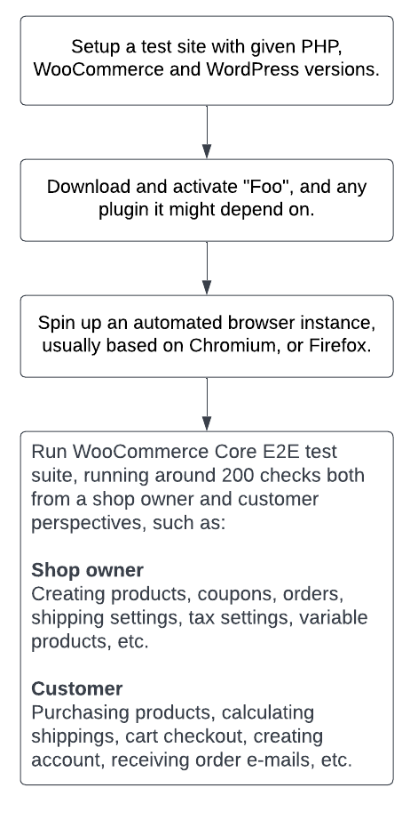

## E2E Test

The E2E (End-to-end) Test creates a temporary WordPress installation with WooCommerce and the extension under test,
and uses a browser that is scripted to perform certain automated tasks, such as completing the WooCommerce onboarding
wizard, creating a product, making a purchase as a customer, verifying the order details as an admin, tweaking tax settings, etc.

The E2E tests that we run are the [WooCommerce Core E2E test suite](https://github.com/woocommerce/woocommerce/tree/trunk/plugins/woocommerce/tests/e2e-pw), which is the
E2E test of WooCommerce itself. With this test, we verify that a given extension does not break the default WooCommerce behaviors.

Right now, we can only run the WooCommerce Core E2E test suite. We are working to add support for running your own custom E2E tests in the future.
