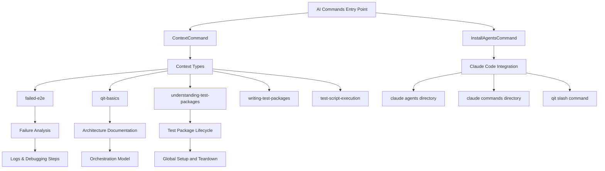
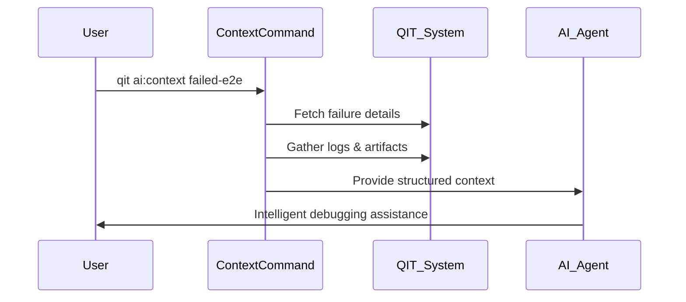
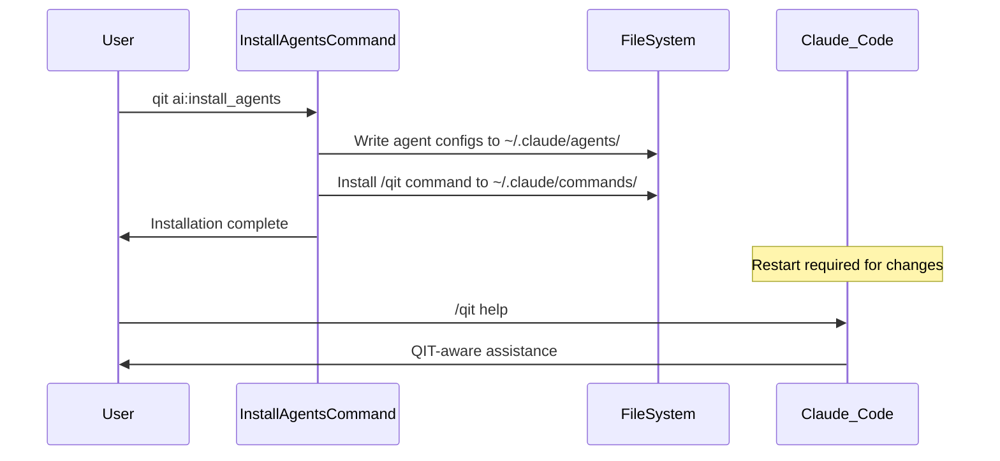

# AI Commands Module

## Overview

The AI Commands module provides intelligent context and tooling for Agentic AI systems (like Claude Code) to better understand, debug, and work with QIT CLI. This module bridges the gap between human debugging workflows and AI-assisted development.

## Architecture



## Core Components

### 1. ContextCommand (`ContextCommand.php`)
**Purpose**: Provides specialized context for different QIT operations to help AI systems understand and debug issues.

**Key Features**:
- **failed-e2e**: Investigation context for debugging E2E test failures
- **qit-basics**: QIT's orchestration model and architecture explanations
- **understanding-test-packages**: Test package lifecycle and state management
- **writing-test-packages**: Best practices for test package creation
- **test-script-execution**: How test package scripts execute in QIT

**Usage Pattern**:
```bash
qit ai:context failed-e2e [run_id]
qit ai:context qit-basics
qit ai:context understanding-test-packages
```

### 2. InstallAgentsCommand (`InstallAgentsCommand.php`)
**Purpose**: Installs QIT-specific AI agent configurations for Claude Code integration.

**Key Features**:
- Installs agents to `~/.claude/agents/`
- Creates `/qit` slash command for Claude Code
- Provides specialized QIT workflow understanding
- Enables contextual debugging assistance

**Installation Locations**:
- `~/.claude/agents/` - AI agent configurations
- `~/.claude/commands/` - Slash command definitions

## Logic Flow

### Context Provision Flow


### Agent Installation Flow


## Integration Points

### With QIT Core System
- **Config System**: Accesses QIT configuration for context
- **Logging System**: Retrieves failure logs and debugging information
- **Test Results**: Analyzes test execution outcomes
- **Environment Data**: Provides environment context for debugging

### With External AI Systems
- **Claude Code**: Primary integration target
- **Agent Definitions**: Structured context for AI understanding
- **Slash Commands**: Direct AI interaction patterns
- **Context Types**: Specialized knowledge domains

## Important Classes

| Class | Responsibility | Key Methods |
|-------|----------------|-------------|
| `ContextCommand` | Context provision for AI systems | `execute()`, context type handlers |
| `InstallAgentsCommand` | Claude Code agent installation | `execute()`, file system operations |

## Context Types Detail

### failed-e2e
- **Purpose**: Debug E2E test failures
- **Data Provided**: Failure logs, commands run, environment state
- **Use Case**: AI-assisted failure analysis and resolution

### qit-basics
- **Purpose**: Explain QIT's unique orchestration approach
- **Data Provided**: Architecture overview, key concepts
- **Use Case**: Onboarding AI agents to QIT's design philosophy

### understanding-test-packages
- **Purpose**: Test package lifecycle education
- **Data Provided**: Global setup, setup, teardown phases
- **Use Case**: Help AI understand test package state management

## Future Enhancements

1. **writing-test-packages**: Best practices context (planned)
2. **Performance Context**: Performance test debugging assistance
3. **Configuration Context**: Complex configuration debugging
4. **Extension Context**: Plugin/theme specific debugging assistance

## Dependencies

- `QIT_CLI\Config` - Configuration access
- `QIT_CLI\QITInput` - Input handling
- `Symfony\Component\Console` - Command infrastructure

## Testing Strategy

AI commands should be tested for:
- Context accuracy and completeness
- Agent installation integrity
- Claude Code integration functionality
- Context type coverage and usefulness