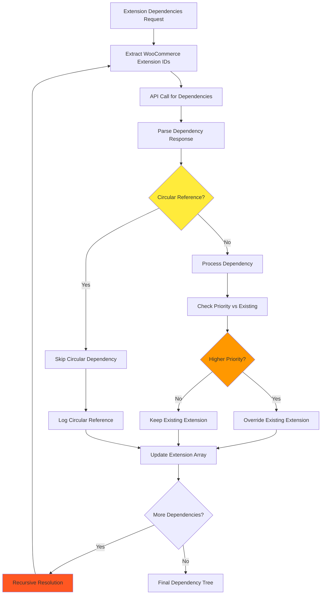
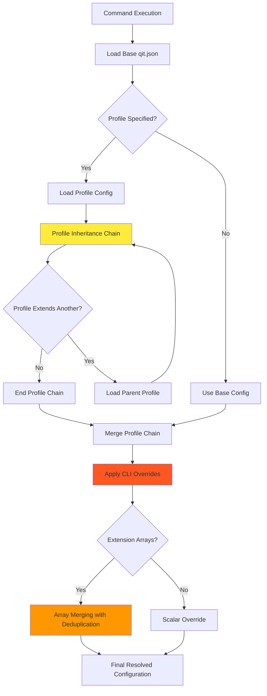
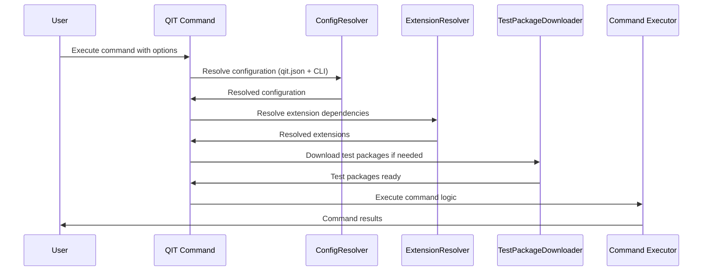
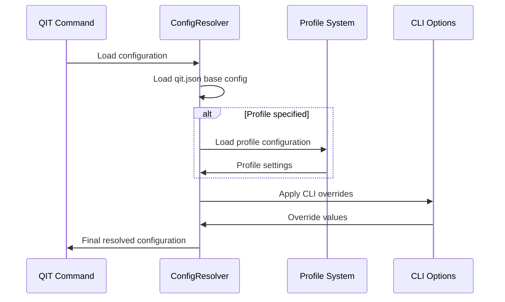
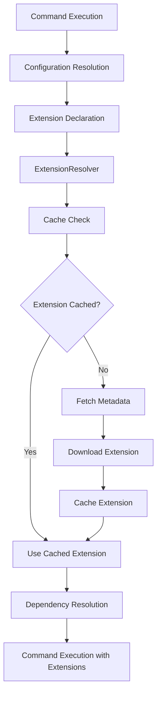

# QIT Commands System

## Overview

The QIT Commands System provides a comprehensive command-line interface for WordPress testing, environment management, test package development, and AI-assisted workflows. Built on Symfony Console, it offers a modular architecture with specialized command categories for different aspects of QIT functionality.

## Architecture

```mermaid
flowchart TD
    A[QIT Commands] --> B[QITCommand Base Class]
    B --> C[AI Commands]
    B --> D[Environment Commands]
    B --> E[Test Package Commands]
    B --> F[Custom Test Commands]
    B --> G[Backend Management]
    B --> H[Partner Commands]
    B --> I[Tunnel Commands]
    B --> J[Group Commands]

    C --> K[ai:context]
    C --> L[ai:install_agents]

    D --> M[env:up]
    D --> N[env:down]
    D --> O[env:enter]
    D --> P[env:exec]
    D --> Q[env:list]
    D --> R[env:reset]

    E --> S[package:scaffold]
    E --> T[package:publish]
    E --> U[package:download]
    E --> V[package:list]
    E --> W[package:delete]

    F --> X[run:e2e]
    F --> Y[CreateRunCommands]
    F --> Z[Dynamic Remote Tests]

    B --> AA[Configuration Integration]
    AA --> BB[ConfigResolver]
    AA --> CC[CLI Overrides]
    AA --> DD[Profile Support]

    B --> EE[Extension Resolution]
    EE --> FF[ExtensionResolver]
    EE --> GG[Dependency Management]
    EE --> HH[Cache Management]
```



## Core Architecture

### Base Command Class: QITCommand (`QITCommand.php`)

**Purpose**: Abstract base class providing common functionality for all QIT commands.

**Key Features**:
- **Configuration Integration**: Automatic qit.json processing with CLI overrides
- **Extension Resolution**: Built-in extension dependency resolution
- **Profile Support**: Profile-based configuration management
- **Environment Integration**: Environment variable and file handling
- **Test Package Support**: Automatic test package resolution and downloading

**Common Options Available to All Commands**:
- `--config`: Path to qit.json configuration file
- `--profile`: Configuration profile selection
- `--env`: Environment variables
- `--env_file`: Environment variable files

**Core Methods**:
```php
protected function getResolvedConfig(): array
protected function getResolvedExtensions(): ResolvedExtensions
protected function getResolvedPackages(): array
```

## Critical Logic Flows

### Complex Extension Dependency Resolution with Priority System
The extension system uses a sophisticated dependency resolution process that handles circular references and priority-based overriding:



**Critical Points**:
1. **Circular Reference Detection**: Prevents infinite loops in dependency trees
2. **Priority-Based Overriding**: Higher priority extensions replace lower priority ones
3. **Recursive Resolution**: Dependencies can have their own dependencies
4. **API Integration**: Network calls embedded in resolution process
5. **Extension ID Extraction**: Complex parsing of WooCommerce extension identifiers

### Command Configuration Precedence with Profile Chain Resolution
Commands use a complex configuration resolution system with multiple inheritance layers:



**Critical Points**:
1. **Profile Inheritance**: Profiles can extend other profiles creating chains
2. **Array Merging Logic**: Extension arrays are merged and deduplicated
3. **CLI Override Precedence**: Command-line options always take highest precedence
4. **Scalar vs Array Handling**: Different merge strategies for different data types

## Command Categories

### 1. AI Commands (`Commands/AI/`)
**Purpose**: Intelligent context provision and Claude Code integration.

| Command | Description |
|---------|-------------|
| `ai:context` | Provide context for AI debugging and development |
| `ai:install_agents` | Install QIT-specific AI agents for Claude Code |

### 2. Environment Commands (`Commands/Environment/`)
**Purpose**: Docker environment lifecycle and management.

| Command | Description |
|---------|-------------|
| `env:up` | Start test environment with WordPress/WooCommerce |
| `env:down` | Stop and remove test environment |
| `env:enter` | Enter running environment shell |
| `env:exec` | Execute commands in environment |
| `env:list` | List active environments |
| `env:reset` | Reset environment to clean state |

### 3. Test Package Commands (`Commands/TestPackages/`)
**Purpose**: Test package lifecycle management and registry operations.

| Command | Description |
|---------|-------------|
| `package:scaffold` | Create new test package structure |
| `package:publish` | Publish test package to registry |
| `package:download` | Download test package from registry |
| `package:list` | List available test packages |
| `package:delete` | Remove test package from registry |

### 4. Custom Test Commands (`Commands/CustomTests/`)
**Purpose**: Local test execution with custom test packages.

| Command | Description |
|---------|-------------|
| `run:e2e` | Execute E2E tests locally |
| `show:report` | Display test execution reports |

### 5. Dynamic Remote Test Commands (`CreateRunCommands.php`)
**Purpose**: Dynamically generated commands for remote test execution.

**Features**:
- **Schema-Based Generation**: Commands generated from QIT Manager schemas
- **Remote Test Types**: `run:security`, `run:phpstan`, `run:woo_e2e`, etc.
- **Configuration Merging**: Profile-level config with CLI overrides
- **SUT Support**: System Under Test specification
- **Group Operations**: Test group management and execution

### 6. Backend Management (`Commands/Backend/`)
**Purpose**: QIT backend environment management.

| Command | Description |
|---------|-------------|
| `backend:add` | Add new QIT backend |
| `backend:current` | Show current active backend |
| `backend:remove` | Remove QIT backend |
| `backend:switch` | Switch between QIT backends |

### 7. Partner Commands (`Commands/Partner/`)
**Purpose**: Partner account management for WooCommerce.com integration.

| Command | Description |
|---------|-------------|
| `partner:add` | Add partner credentials |
| `partner:remove` | Remove partner account |
| `partner:switch` | Switch active partner |

### 8. Tunnel Commands (`Commands/Tunnel/`)
**Purpose**: Tunnel configuration for external service access.

| Command | Description |
|---------|-------------|
| `tunnel:setup` | Configure tunnel service |
| `tunnel:set_default` | Set default tunnel configuration |

### 9. Group Commands (`Commands/Group/`)
**Purpose**: Test group management and batch operations.

| Command | Description |
|---------|-------------|
| `group:register` | Register new test group |
| `group:run` | Execute test group |
| `group:show` | Display group details |
| `group:fetch` | Fetch group results |
| `group:clear` | Clear group data |

## Command Flow Architecture

### Standard Command Execution Flow


### Configuration Resolution Flow


### Extension Resolution Integration


## Advanced Features

### 1. Dynamic Command Generation
The `CreateRunCommands` class dynamically generates remote test commands based on schemas from the QIT Manager:

```php
// Commands like run:security, run:phpstan are generated dynamically
$schemas = fetch_test_schemas_from_manager();
foreach ($schemas as $schema) {
    register_dynamic_command($schema);
}
```

### 2. Configuration Precedence
Configuration resolution follows a clear precedence order:
1. **CLI Options** (highest priority)
2. **Profile Configuration**
3. **Base qit.json Configuration**
4. **Default Values** (lowest priority)

### 3. Extension Integration
All commands automatically support extension resolution:
- Plugin dependencies from wporg/wccom
- Local plugin/theme paths
- ZIP file uploads
- Version constraints and compatibility

### 4. Test Package Integration
Commands automatically handle test package requirements:
- Remote package downloading from registry
- Local package loading
- Dependency resolution
- Cache management

## Important Base Class Methods

### Configuration Methods
```php
protected function getResolvedConfig(): array
protected function configureProfileOption(): void
protected function configureEnvironmentOption(): void
```

### Extension Methods
```php
protected function getResolvedExtensions(): ResolvedExtensions
protected function resolveExtensions(): void
```

### Test Package Methods
```php
protected function getResolvedPackages(): array
protected function resolveTestPackages(): void
```

### Utility Methods
```php
protected function configure(): void
protected function execute(InputInterface $input, OutputInterface $output): int
```

## Command Development Patterns

### 1. Standard Command Structure
```php
class MyCommand extends QITCommand {
    protected static $defaultName = 'my:command';
    protected string $test_type = 'e2e'; // Override for specific test type

    protected function configure(): void {
        parent::configure(); // Essential for base functionality
        $this->setDescription('My command description');
        // Add command-specific options
    }

    protected function execute(InputInterface $input, OutputInterface $output): int {
        $config = $this->getResolvedConfig();
        $extensions = $this->getResolvedExtensions();
        $packages = $this->getResolvedPackages();

        // Command implementation
        return Command::SUCCESS;
    }
}
```

### 2. Profile-Aware Commands
```php
protected function configureProfileOption(): void {
    $this->addOption('profile', 'p', InputOption::VALUE_OPTIONAL, 'Configuration profile');
}
```

### 3. Environment-Aware Commands
```php
protected function configureEnvironmentOption(): void {
    $this->addOption('env', '', InputOption::VALUE_OPTIONAL|InputOption::VALUE_IS_ARRAY, 'Environment variables');
    $this->addOption('env_file', '', InputOption::VALUE_OPTIONAL|InputOption::VALUE_IS_ARRAY, 'Environment files');
}
```

## Integration Points

### With PreCommand System
- **Automatic Configuration Resolution**: All commands get resolved config
- **Extension Resolution**: Built-in extension dependency handling
- **Test Package Resolution**: Automatic package downloading and caching

### With Environment System
- **Environment Integration**: Commands can start/manage environments
- **Variable Management**: Environment variable distribution
- **Resource Preparation**: Extensions and packages prepared for environments

### With AI System
- **Context Provision**: AI commands provide debugging context
- **Agent Integration**: Commands work with Claude Code agents
- **Intelligent Assistance**: AI-aware command execution

## Testing Strategy

Commands should be tested for:
- **Configuration Resolution**: Proper config merging and precedence
- **Extension Integration**: Extension resolution and dependency handling
- **Option Processing**: CLI option parsing and validation
- **Error Handling**: Graceful failure and error reporting
- **Integration**: Interaction with other QIT systems

## Future Enhancements

1. **Interactive Commands**: Rich CLI interactions with prompts and selections
2. **Command Aliasing**: User-defined command shortcuts
3. **Plugin System**: Extensible command architecture
4. **Batch Operations**: Multi-command execution workflows
5. **Command Validation**: Pre-execution validation and safety checks

## Command Categories Summary

| Category | Commands | Primary Purpose |
|----------|----------|-----------------|
| **AI** | 2 | AI integration and context provision |
| **Environment** | 6 | Docker environment management |
| **TestPackages** | 5 | Test package registry operations |
| **CustomTests** | 2+ | Local test execution |
| **Backend** | 4 | QIT backend management |
| **Partner** | 3 | Partner account management |
| **Tunnel** | 2 | External service tunneling |
| **Group** | 5 | Test group batch operations |
| **Dynamic** | 10+ | Remote test type execution |

**Total Commands**: 50+ (including dynamically generated remote test commands)