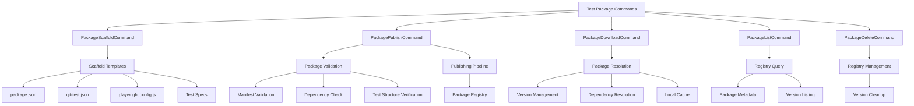
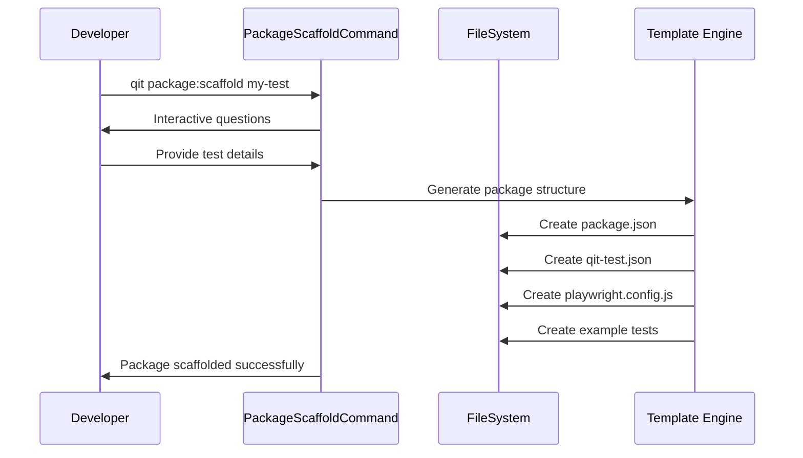
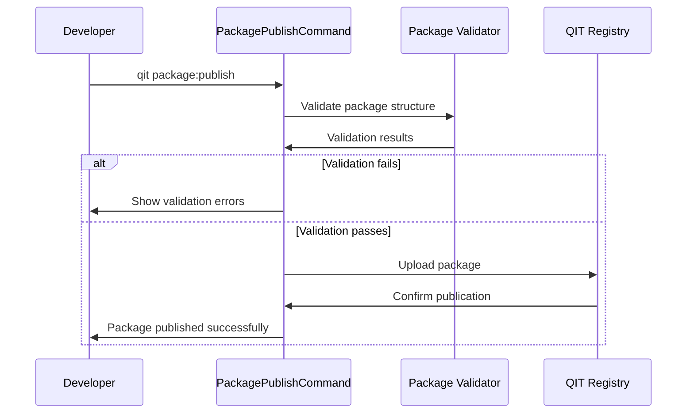
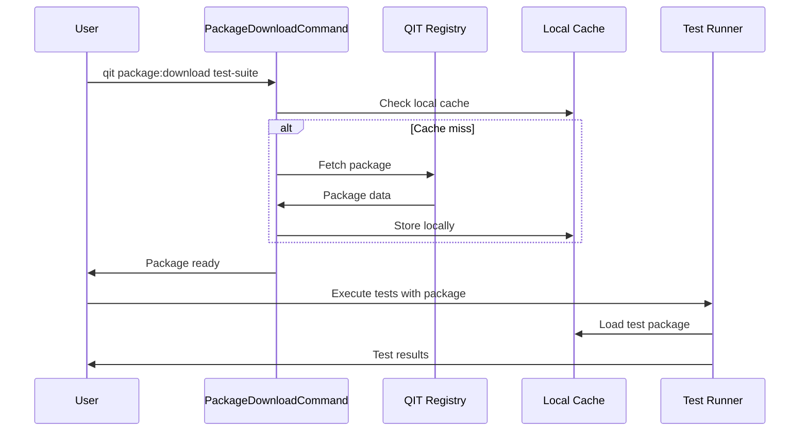
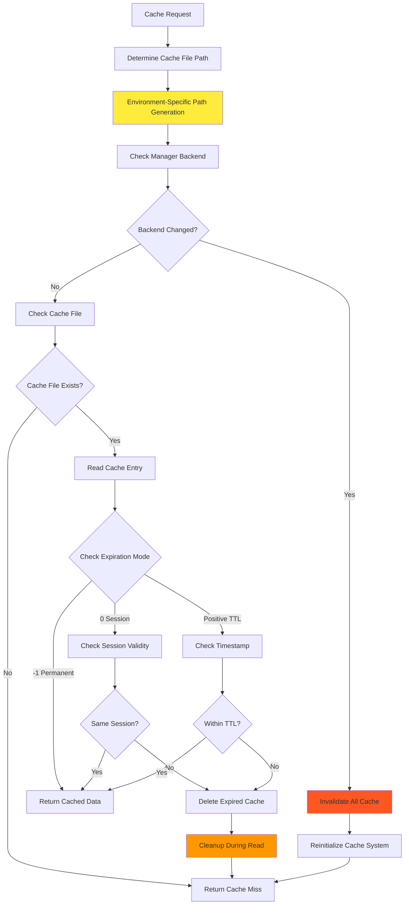
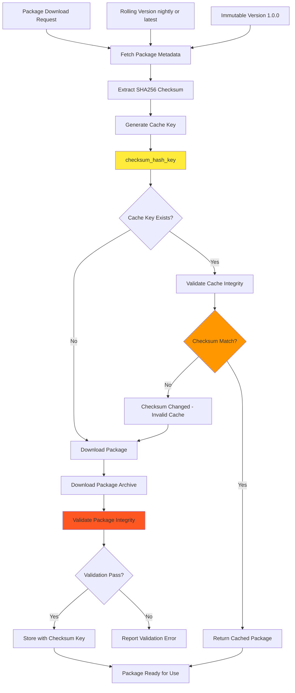

# Test Packages System

## Overview

The Test Packages System is a comprehensive solution for creating, managing, and distributing custom test packages in QIT CLI. This system enables developers to create reusable test suites that can be executed across different WordPress environments and configurations.

## Architecture



## Core Components

### 1. PackageScaffoldCommand (`PackageScaffoldCommand.php`)
**Purpose**: Creates new test package structures with proper templates and configuration.

**Key Features**:
- Interactive scaffolding process
- Template generation for different test types
- Proper package.json and qit-test.json setup
- Playwright configuration generation
- Example test specification creation

### 2. PackagePublishCommand (`PackagePublishCommand.php`)
**Purpose**: Publishes test packages to the QIT registry for distribution.

**Key Features**:
- Package validation before publishing
- Version management and conflict resolution
- Manifest verification
- Dependency validation
- Registry upload and metadata management

### 3. PackageDownloadCommand (`PackageDownloadCommand.php`)
**Purpose**: Downloads and manages test packages from the registry.

**Key Features**:
- Package resolution by name/version
- Dependency tree resolution
- Local caching mechanism
- Version pinning and updates
- Integrity verification

### 4. PackageListCommand (`PackageListCommand.php`)
**Purpose**: Lists available test packages and their metadata.

**Key Features**:
- Registry browsing
- Version information display
- Package metadata presentation
- Search and filtering capabilities
- Dependency information

### 5. PackageDeleteCommand (`PackageDeleteCommand.php`)
**Purpose**: Removes test packages from registry and local cache.

**Key Features**:
- Registry cleanup
- Version-specific deletion
- Cascade dependency checking
- Local cache management
- Confirmation workflows

## Logic Flow

### Package Creation Flow


### Package Publishing Flow


### Package Download & Execution Flow


## Critical Logic Flows

### Complex Cache Management with Environment-Specific Invalidation
The caching system uses sophisticated cache invalidation logic that depends on current environment state:



**Critical Points**:
1. **Environment-Dependent Paths**: Cache file paths change with manager backend
2. **Multiple Expiration Modes**: -1 (permanent), 0 (session), positive (TTL seconds)
3. **Read-Time Cleanup**: Expired cache cleanup happens during reads, not writes
4. **Backend Change Detection**: Automatic cache invalidation when environment changes
5. **Session-Based Validation**: Session cache depends on current execution context

### Test Package Checksum-Based Validation with Rolling Version Support
Test package caching uses checksums to handle both immutable and rolling versions:



**Critical Points**:
1. **Checksum-First Approach**: Always fetch metadata with checksum before cache check
2. **Rolling Version Support**: latest/nightly/rc versions get new cache entries when updated
3. **Immutable Version Benefits**: Immutable versions (1.0.0) benefit from checksum validation
4. **Cache Key Strategy**: Uses SHA256 checksum as cache key component for uniqueness
5. **Integrity Validation**: Multiple validation layers ensure package integrity

## Package Structure

### Standard Package Layout
```
my-test-package/
├── package.json                 # Node.js dependencies
├── qit-test.json               # QIT test manifest
├── playwright.config.js        # Playwright configuration
├── tests/                      # Test specifications
│   ├── setup.js               # Test setup scripts
│   ├── teardown.js            # Test cleanup scripts
│   └── *.spec.js              # Test specifications
├── global-setup.js            # Global test setup
├── global-teardown.js         # Global test teardown
└── README.md                  # Package documentation
```

### qit-test.json Manifest
```json
{
  "name": "my-test-package",
  "version": "1.0.0",
  "description": "Custom E2E tests for WooCommerce",
  "author": "Developer Name",
  "qit_version": ">=1.0.0",
  "test_packages": {
    "default": {
      "test_type": "e2e",
      "runner": "playwright",
      "specs": ["tests/*.spec.js"],
      "requires_network": false,
      "global_setup": "./global-setup.js",
      "global_teardown": "./global-teardown.js"
    }
  }
}
```

## Integration Points

### With PreCommand System
- **Configuration Resolution**: Package manifests processed by `ConfigResolver`
- **Extension Management**: Test packages can declare extension dependencies
- **Environment Setup**: Packages integrated with environment orchestration

### With Environment System
- **Test Execution**: Packages executed within QIT environments
- **Dependency Management**: Extension dependencies resolved and installed
- **State Management**: Global setup/teardown integration

### With Registry System
- **Package Storage**: Centralized package repository
- **Version Management**: Semantic versioning and conflict resolution
- **Metadata Management**: Package descriptions, dependencies, and compatibility

## Important Classes & Integration

| Class | Responsibility | Key Dependencies |
|-------|----------------|------------------|
| `PackageScaffoldCommand` | Package structure generation | `WooExtensionsList`, Template system |
| `PackagePublishCommand` | Registry publication | Package validator, Registry API |
| `PackageDownloadCommand` | Package acquisition | Registry client, Cache manager |
| `PackageListCommand` | Package discovery | Registry API, Metadata formatter |
| `PackageDeleteCommand` | Package cleanup | Registry API, Dependency checker |

## Test Package Lifecycle

### 1. Development Phase
- **Scaffold**: Create package structure
- **Implement**: Write test specifications
- **Local Testing**: Test package locally
- **Validation**: Ensure package meets requirements

### 2. Publishing Phase
- **Pre-publish Validation**: Structure and manifest checks
- **Registry Upload**: Package and metadata submission
- **Version Management**: Semantic versioning enforcement
- **Documentation**: README and usage examples

### 3. Distribution Phase
- **Registry Listing**: Package appears in registry
- **Discovery**: Users can find and download package
- **Version Updates**: New versions can be published
- **Deprecation**: Old versions can be marked deprecated

### 4. Execution Phase
- **Download**: Package retrieved from registry
- **Dependency Resolution**: Required extensions identified
- **Environment Setup**: Test environment prepared
- **Test Execution**: Package tests run in environment
- **Result Collection**: Test outcomes aggregated

## Advanced Features

### Version Management
- **Semantic Versioning**: Enforced version numbering
- **Version Pinning**: Lock to specific package versions
- **Update Notifications**: Alert when new versions available
- **Compatibility Checking**: Ensure QIT version compatibility

### Dependency System
- **Extension Dependencies**: Declare required plugins/themes
- **Package Dependencies**: Reference other test packages
- **Version Constraints**: Specify compatible dependency versions
- **Conflict Resolution**: Handle conflicting requirements

### Caching Strategy
- **Local Cache**: Downloaded packages stored locally
- **Integrity Verification**: Checksums and signature validation
- **Cache Invalidation**: Refresh when packages updated
- **Storage Management**: Cleanup old or unused packages

## Testing Strategy

Test packages system should be tested for:
- **Package Creation**: Scaffolding generates correct structure
- **Validation Logic**: All validation rules properly enforced
- **Publishing Flow**: Registry integration works correctly
- **Download/Cache**: Package retrieval and storage functions
- **Version Management**: Semantic versioning enforced
- **Dependency Resolution**: Complex dependency trees resolved

## Future Enhancements

1. **Package Templates**: Multiple scaffold templates for different test types
2. **Private Registries**: Support for organization-specific package repositories
3. **Package Analytics**: Usage metrics and adoption tracking
4. **Automated Testing**: CI/CD integration for package validation
5. **Package Collections**: Grouped packages for related functionality