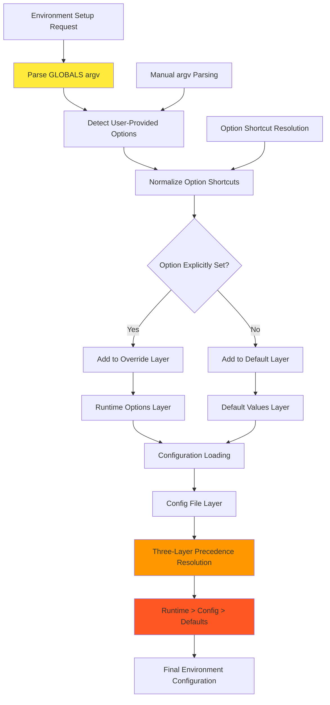
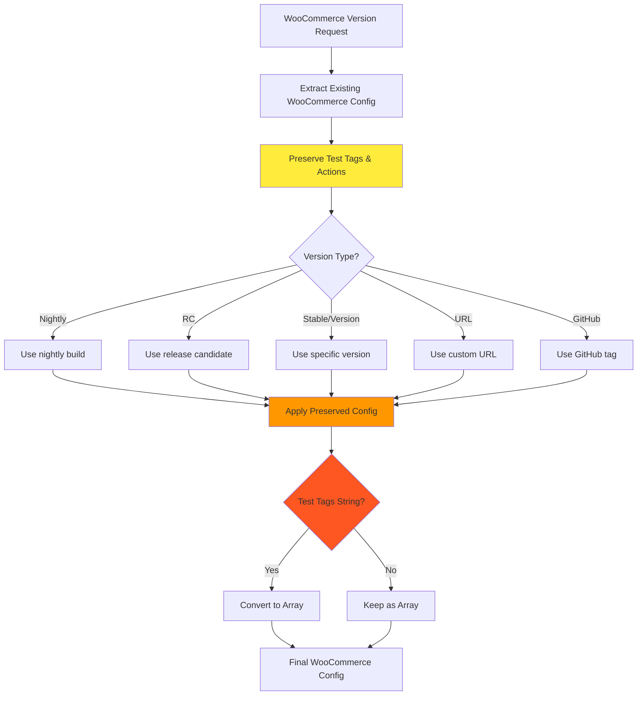
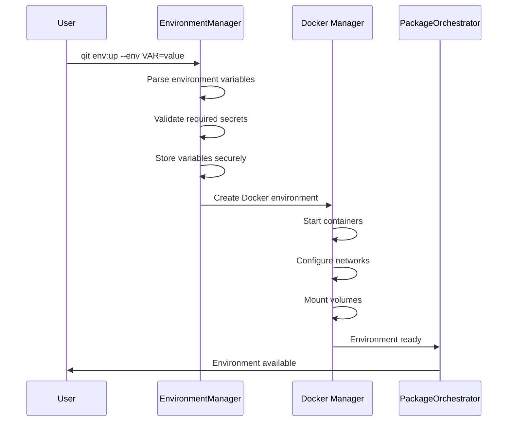
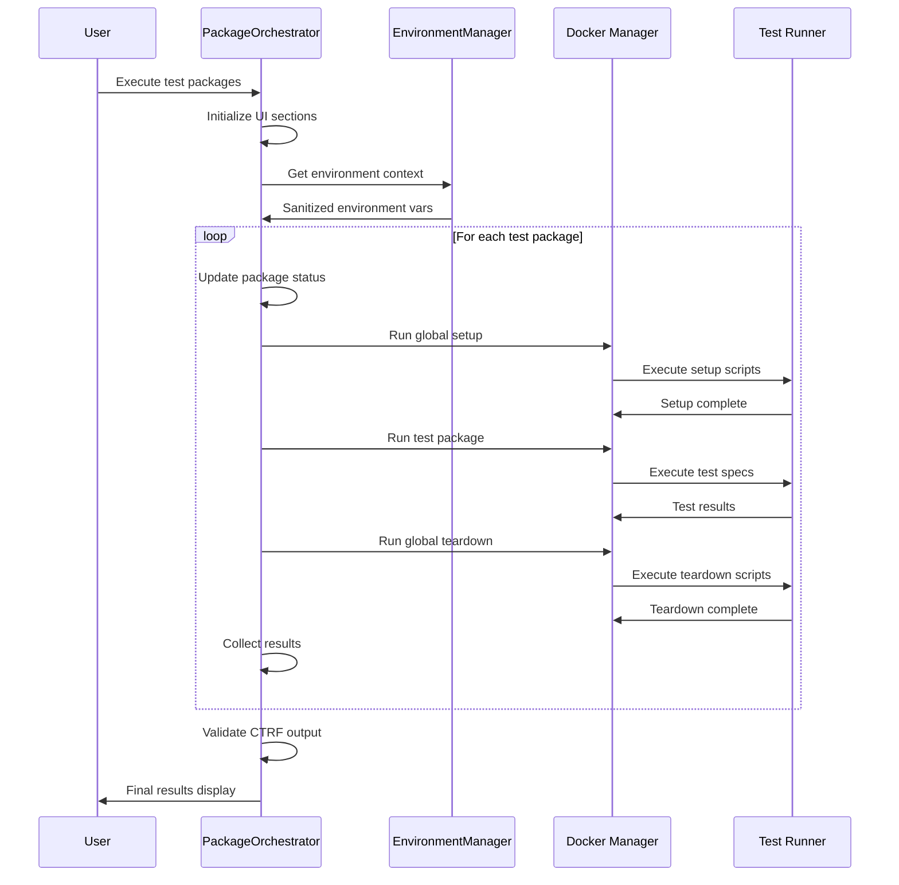
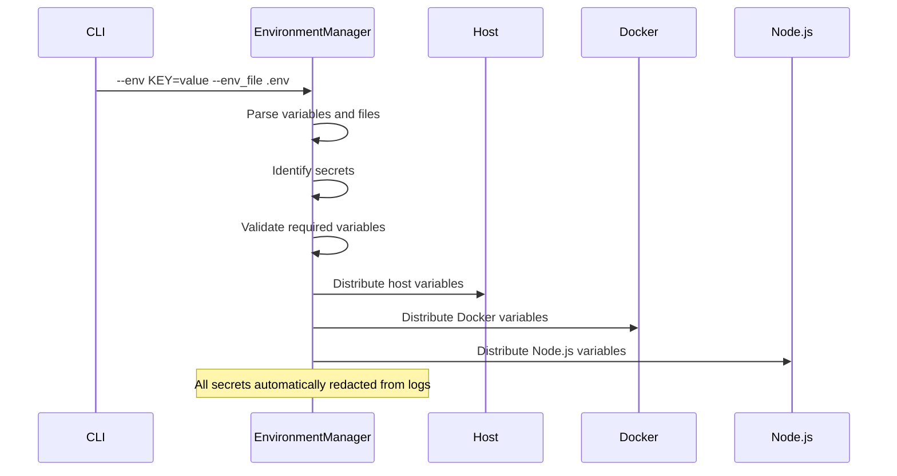

# Environment Management System

## Overview

The Environment Management System handles Docker-based test environments, environment variables, package orchestration, and test execution lifecycle. This system provides isolated, reproducible environments for running WordPress tests with different configurations, extensions, and test packages.

## Architecture

```mermaid
flowchart TD
    A[Environment Management] --> B[EnvironmentManager]
    A --> C[PackageOrchestrator]
    A --> D[Docker Manager]
    A --> E[Environment Types]

    B --> F[Environment Variables]
    B --> G[Secret Management]
    B --> H[Variable Distribution]
    F --> I[CLI Variables --env]
    F --> J[Environment Files --env_file]
    G --> K[Secret Validation]
    G --> L[Redaction Logic]
    H --> M[Host Context]
    H --> N[Docker Context]
    H --> O[Node.js Context]

    C --> P[Test Execution UI]
    C --> Q[Lifecycle Management]
    C --> R[CTRF Validation]
    P --> S[Package Status Display]
    P --> T[Progress Tracking]
    Q --> U[Global Setup]
    Q --> V[Test Execution]
    Q --> W[Global Teardown]

    D --> X[Container Management]
    D --> Y[Volume Mapping]
    D --> Z[Network Configuration]

    E --> AA[E2E Environment]
    E --> BB[Performance Environment]
    E --> CC[Custom Environments]

    AA --> DD[E2EEnvInfo]
    AA --> EE[E2EEnvironment]
    BB --> FF[PerformanceEnvInfo]
    BB --> GG[PerformanceEnvironment]
```

## Critical Logic Flows

### Complex Environment Setup with Option Precedence
The environment setup process involves a sophisticated three-layer precedence system that manually parses command-line arguments to determine user intent:

**Critical Points**:
1. **Manual argv Parsing**: Uses `$GLOBALS['argv']` instead of Symfony Console mechanisms
2. **User Intent Detection**: Complex logic to determine if user explicitly set options vs defaults
3. **Three-Layer Precedence**: Runtime options > Config file > Defaults
4. **Shortcut Normalization**: Option shortcuts resolved before precedence application

### WooCommerce Version Resolution with Test Tag Preservation
Version resolution involves complex state preservation and conditional transformations:

**Critical Points**:
1. **State Preservation**: Existing test_tags and actions must be preserved across version changes
2. **Conditional Conversion**: String test_tags converted to arrays only when needed
3. **Multiple Version Sources**: Different resolution paths for nightly, RC, stable, URL, GitHub
4. **Configuration Mutation**: Method mutates based on existing plugin configurations

## Core Components

### 1. EnvironmentManager (`EnvironmentManager.php`)
**Purpose**: Centralized management of environment variables, secrets, and secure distribution.

**Key Features**:
- **Environment Variable Parsing**: CLI `--env` and `--env_file` processing
- **Secret Management**: Secure handling of sensitive values
- **Variable Distribution**: Context-aware variable injection
- **Redaction Logic**: Automatic secret filtering from logs
- **Immutable State**: Prevents configuration drift

**Design Principles**:
- Single source of truth for all environment variables
- Immutable after initialization to prevent state bugs
- Clear separation between regular variables and secrets
- Secure by default with automatic secret redaction

### 2. PackageOrchestrator (`PackageOrchestrator.php`)
**Purpose**: Orchestrates test package execution with rich UI and lifecycle management.

**Key Features**:
- **Beautiful UI**: Native Symfony Console components for status display
- **Lifecycle Management**: Global setup, test execution, teardown phases
- **CTRF Validation**: Common Test Result Format validation
- **Progress Tracking**: Real-time package execution status
- **CI Environment Detection**: Optimized output for CI/CD systems

### 3. Docker Manager (`Docker.php`)
**Purpose**: Manages Docker containers, networks, and volumes for test environments.

**Key Features**:
- **Container Lifecycle**: Start, stop, monitor Docker containers
- **Volume Management**: Host-to-container file system mapping
- **Network Configuration**: Isolated test networks
- **Resource Management**: Memory, CPU constraints
- **Health Checking**: Container readiness verification

### 4. Environment Types

#### E2E Environment (`E2EEnvironment.php`, `E2EEnvInfo.php`)
**Purpose**: End-to-end testing environment with WordPress, WooCommerce, and test packages.

**Features**:
- WordPress environment setup
- WooCommerce installation and configuration
- Plugin/theme activation
- Test package execution
- Browser automation support

#### Performance Environment
**Purpose**: Performance testing with K6 and metrics collection.

**Features**:
- K6 test runner integration
- Performance metrics collection
- Load testing capabilities
- Baseline comparison

## Logic Flow

### Environment Setup Flow

### Test Package Execution Flow

### Environment Variable Distribution Flow

## Important Classes & Responsibilities

| Class | Responsibility | Key Methods |
|-------|----------------|-------------|
| `EnvironmentManager` | Environment variable management | `parseEnvVars()`, `validateSecrets()`, `distributeVars()` |
| `PackageOrchestrator` | Test execution orchestration | `execute()`, `updateStatus()`, `collectResults()` |
| `Docker` | Container management | `startContainer()`, `configureNetwork()`, `mountVolumes()` |
| `E2EEnvironment` | E2E test environment | `setup()`, `teardown()`, `executeTests()` |
| `CTRFValidator` | Test result validation | `validate()`, `formatResults()` |

## Environment Variable System

### Variable Types
1. **Regular Variables**: Standard environment variables
2. **Secrets**: Sensitive values (API keys, passwords, tokens)
3. **File Variables**: Variables loaded from `.env` files
4. **CLI Variables**: Variables passed via `--env` flag

### Distribution Contexts
1. **Host Context**: Variables available to QIT CLI process
2. **Docker Context**: Variables injected into containers
3. **Node.js Context**: Variables for test package execution

### Security Features
- **Automatic Redaction**: Secrets never appear in logs
- **Validation**: Required secrets verified before execution
- **Immutable State**: Variables cannot be changed after initialization
- **Context Separation**: Different contexts get appropriate variable subsets

## Test Package Lifecycle

### Phase 1: Global Setup
- Environment initialization
- Extension installation
- Database setup
- Service configuration

### Phase 2: Test Execution
- Test package loading
- Spec file execution
- Result collection
- Status monitoring

### Phase 3: Global Teardown
- Result aggregation
- Resource cleanup
- Container shutdown
- Artifact collection

## Docker Integration

### Container Management
- **Lifecycle**: Start, monitor, stop containers
- **Health Checks**: Verify container readiness
- **Resource Limits**: CPU, memory constraints
- **Network Isolation**: Separate test networks

### Volume Management
- **Source Code**: Host-to-container file mapping
- **Test Artifacts**: Result collection volumes
- **Database Persistence**: Data volume management
- **Cache Optimization**: Shared dependency volumes

### Network Configuration
- **Service Discovery**: Container-to-container communication
- **Port Mapping**: External service access
- **Traffic Isolation**: Separate test networks
- **Load Balancing**: Multiple container coordination

## Advanced Features

### CTRF Integration
- **Result Validation**: Common Test Result Format validation
- **Result Merging**: Multiple package result aggregation
- **Format Conversion**: Convert between result formats
- **Metadata Enrichment**: Add environment context to results

### UI/UX Features
- **Real-time Status**: Live package execution updates
- **Progress Bars**: Visual execution progress
- **Color Coding**: Status-based output styling
- **CI Optimization**: Streamlined output for automation

### Performance Optimization
- **Container Reuse**: Warm container startup
- **Volume Caching**: Dependency caching
- **Parallel Execution**: Concurrent package execution
- **Resource Monitoring**: Memory and CPU tracking

## Integration Points

### With PreCommand System
- **Configuration**: Environment settings from config files
- **Extension Management**: Plugin/theme installation
- **Variable Resolution**: CLI override handling

### With Test Package System
- **Package Loading**: Test package discovery and loading
- **Execution Context**: Environment preparation for packages
- **Result Collection**: Package output aggregation

### With Commands System
- **Environment Commands**: `env:up`, `env:down`, `env:reset`
- **Test Commands**: Environment integration for test execution
- **Debug Commands**: Environment inspection and debugging

## Testing Strategy

Environment system should be tested for:
- **Variable Management**: Secure handling of environment variables
- **Docker Integration**: Container lifecycle management
- **Test Execution**: Package orchestration functionality
- **UI Components**: Status display and progress tracking
- **Security**: Secret redaction and secure distribution
- **Performance**: Resource usage and optimization

## Future Enhancements

1. **Multi-Environment Support**: Parallel environment execution
2. **Cloud Integration**: Cloud-based environment provisioning
3. **Advanced Monitoring**: Resource usage dashboards
4. **Environment Templates**: Pre-configured environment types
5. **Auto-scaling**: Dynamic resource allocation based on load