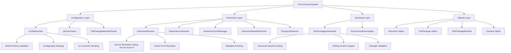
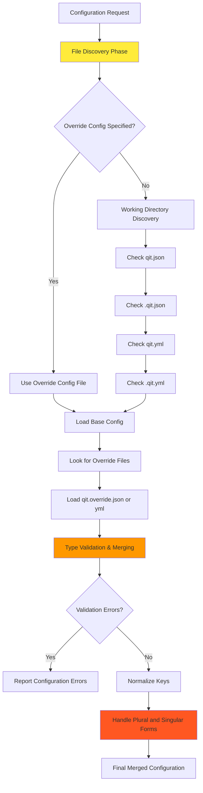
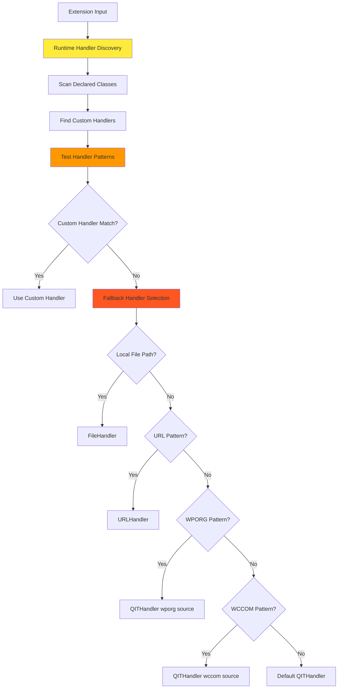
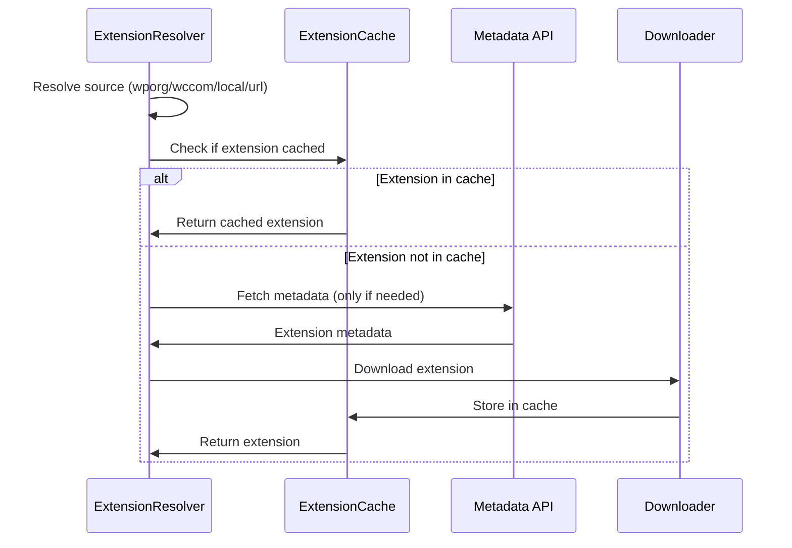
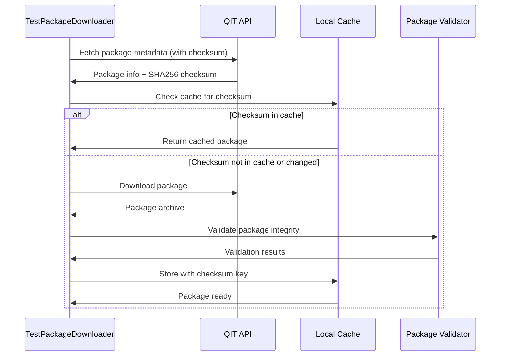
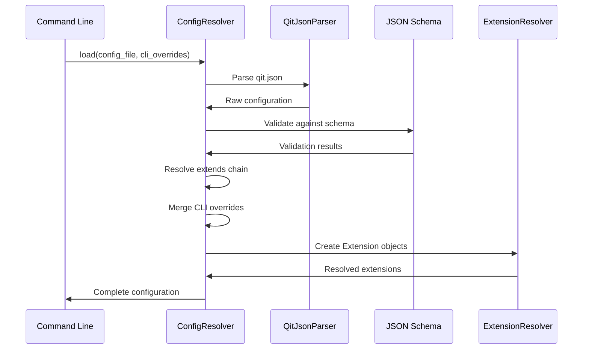
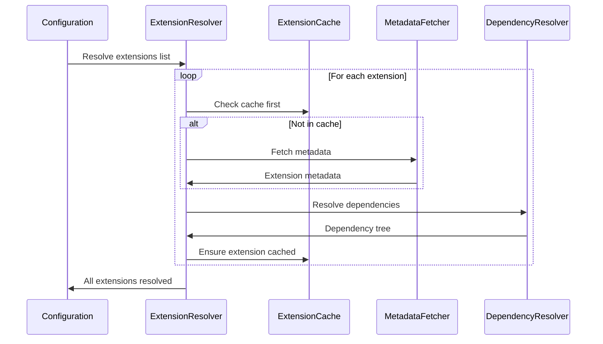
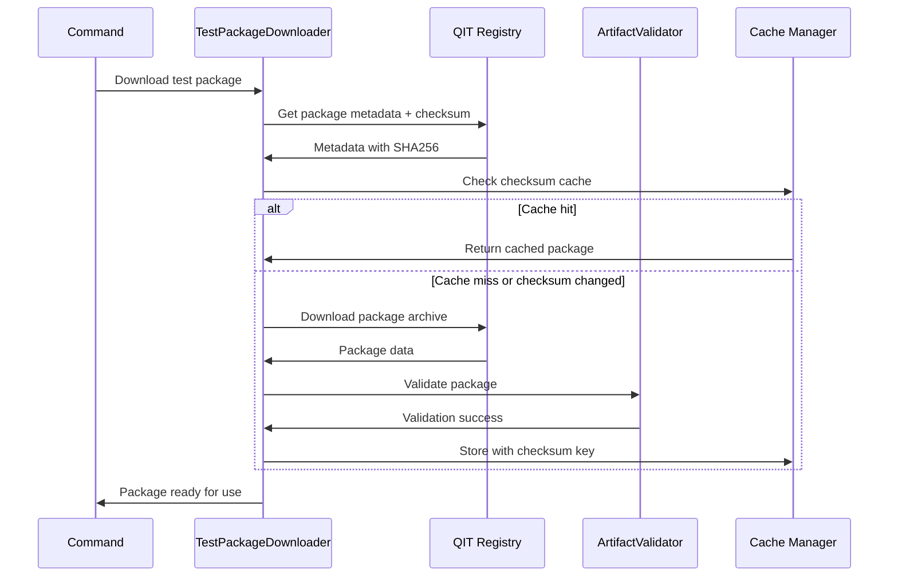
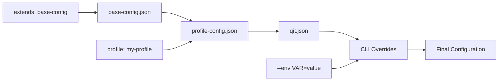

# PreCommand Architecture System

## Overview

The PreCommand Architecture System is the foundational layer that handles configuration resolution, extension management, test package downloading, and command preprocessing before actual test execution. This system provides a clean separation between command input processing and execution, enabling complex configuration merging, validation, and resource resolution.

## Architecture

## Critical Logic Flows

### Complex Configuration Resolution Process
The configuration resolution involves a sophisticated multi-layer precedence system that can be confusing due to its complexity:

**Critical Points**:
1. **File Discovery Order**: 4 different file patterns checked in working directory
2. **Override Precedence**: Override files always win over base files
3. **Type Validation**: Strict type checking during merge prevents invalid configs
4. **Key Normalization**: Bidirectional conversion between plural/singular forms (plugins/plugin)

### Extension Handler Selection Decision Tree
Extension resolution uses a complex handler selection system with runtime class discovery:

**Critical Points**:
1. **Runtime Discovery**: `get_declared_classes()` used to find custom handlers
2. **Pattern Matching**: Complex regex patterns determine handler selection
3. **Fallback Chain**: Multiple fallback levels prevent resolution failures
4. **Source Attribution**: Handler selection determines metadata source

## Core Components

### Configuration Layer

#### 1. ConfigResolver (`ConfigResolver.php`)
**Purpose**: Single-pass configuration resolver handling JSON loading, validation, extends resolution, and CLI overrides.

**Key Features**:
- **JSON Schema Validation**: Ensures configuration integrity
- **Extends Resolution**: Handles configuration inheritance
- **CLI Override Merging**: Command-line parameter precedence
- **Extension Creation**: Converts config to Extension objects
- **Single-Pass Processing**: Efficient configuration resolution

**Replaces Legacy Components**:
- ResolvedConfiguration
- ConfigMerger
- ExtensionFactory
- Parts of QitJsonParser

#### 2. QitJsonParser (`QitJsonParser.php`)
**Purpose**: Parses and validates qit.json configuration files.

**Key Features**:
- Configuration file discovery and loading
- Schema validation against qit-schema.json
- Environment variable substitution
- Profile and extends chain resolution

#### 3. TestPackageManifestParser (`TestPackageManifestParser.php`)
**Purpose**: Handles test package manifest parsing and validation.

**Key Features**:
- Test package manifest validation
- Package metadata extraction
- Dependency requirement parsing
- Compatibility checking

### Extensions Layer

#### 1. ExtensionResolver (`ExtensionResolver.php`)
**Purpose**: Main extension resolver that orchestrates the resolution process with intelligent caching.

**Key Features**:
- **Cache-First Resolution**: Checks cache before API calls
- **Source Resolution**: Handles wporg/wccom/local/url sources
- **API Call Minimization**: Prevents rate limiting
- **Shared Cache**: Cross-test-run cache coordination

**Caching Strategy**:

#### 2. DependencyResolver (`DependencyResolver.php`)
**Purpose**: Resolves extension dependency trees and handles conflicts.

**Key Features**:
- Recursive dependency resolution
- Version constraint satisfaction
- Circular dependency detection
- Conflict resolution strategies

#### 3. ExtensionCacheManager (`ExtensionCacheManager.php`)
**Purpose**: Manages local caching of downloaded extensions.

**Key Features**:
- File-based extension caching
- Cache invalidation strategies
- Storage optimization
- Integrity verification

#### 4. ExtensionMetadataFetcher (`ExtensionMetadataFetcher.php`)
**Purpose**: Fetches extension metadata from various sources with caching.

**Key Features**:
- Multi-source metadata fetching (wporg, wccom)
- Metadata caching to reduce API calls
- Version resolution and compatibility checking
- Rate limiting protection

#### 5. EntrypointDetector (`EntrypointDetector.php`)
**Purpose**: Detects main plugin/theme files within extensions.

**Key Features**:
- Plugin header detection
- Theme style.css detection
- Main file identification
- Multi-file extension handling

### Download Layer

#### 1. TestPackageDownloader (`TestPackageDownloader.php`)
**Purpose**: Downloads and caches remote test packages with checksum-based validation.

**Key Features**:
- **Checksum-Based Caching**: SHA256 validation for integrity
- **Rolling Version Support**: Handles latest, rc, nightly versions
- **Cache Key Generation**: `test_package_checksum_[checksum]` format
- **Immutable + Mutable Support**: Works with both version types

**Caching Flow**:

#### 2. EnvironmentDownloader (`EnvironmentDownloader.php`)
**Purpose**: Downloads environment-specific resources and configurations.

**Key Features**:
- Environment resource fetching
- Configuration template downloading
- Resource caching and validation
- Environment compatibility checking

### Objects Layer

#### 1. Extension Object (`Extension.php`)
**Purpose**: Represents a resolved extension with metadata and file paths.

**Properties**:
- Extension metadata (name, version, type)
- File system paths
- Dependency information
- Activation requirements

#### 2. TestPackage Object (`TestPackage.php`)
**Purpose**: Represents a test package with execution requirements.

**Properties**:
- Package identification
- Execution configuration
- Dependency requirements
- Resource locations

#### 3. TestPackageManifest (`TestPackageManifest.php`)
**Purpose**: Comprehensive test package manifest with validation and metadata.

**Properties**:
- Package metadata
- Test configuration
- Dependency declarations
- Execution requirements

#### 4. SutInput Object (`SutInput.php`)
**Purpose**: Represents System Under Test input specification.

**Properties**:
- SUT identification
- Version requirements
- Configuration overrides
- Test parameters

## Logic Flow

### Configuration Resolution Flow

### Extension Resolution Flow

### Test Package Download Flow

## Advanced Features

### Configuration Inheritance

### Caching Strategy
- **Extension Caching**: File-based with integrity checks
- **Metadata Caching**: In-memory with TTL expiration
- **Package Caching**: Checksum-based for version integrity
- **Shared Cache**: Cross-session cache reuse

### Schema Validation
- **qit-schema.json**: Main configuration schema
- **test-package-manifest-schema.json**: Test package validation
- **ctrf-schema.json**: Test result format validation

## Integration Points

### With Commands System
- **Pre-execution**: Configuration resolution before command execution
- **Override Handling**: CLI parameter precedence management
- **Resource Preparation**: Extension and package preparation

### With Environment System
- **Resource Provision**: Extensions and packages for environment setup
- **Configuration Injection**: Resolved config into environment
- **Dependency Management**: Extension dependency satisfaction

### With Test Package System
- **Package Resolution**: Remote package downloading and caching
- **Manifest Processing**: Test package configuration parsing
- **Dependency Linking**: Package-to-extension relationships

## Important Classes Summary

| Class | Primary Responsibility | Replaces/Consolidates |
|-------|------------------------|----------------------|
| `ConfigResolver` | Single-pass configuration resolution | ResolvedConfiguration, ConfigMerger, ExtensionFactory |
| `ExtensionResolver` | Cache-first extension resolution | Multiple resolver classes |
| `TestPackageDownloader` | Checksum-based package caching | Package download logic |
| `DependencyResolver` | Extension dependency trees | Dependency management |
| `ExtensionCacheManager` | Extension file caching | Cache coordination |

## Testing Strategy

PreCommand system should be tested for:
- **Configuration Resolution**: Schema validation and merging logic
- **Extension Resolution**: Source detection and caching
- **Package Downloading**: Checksum validation and integrity
- **Dependency Resolution**: Complex dependency trees
- **Cache Management**: Cache invalidation and integrity
- **Schema Compliance**: All validation rules

## Performance Optimizations

1. **Cache-First Resolution**: Minimize API calls
2. **Checksum Validation**: Prevent unnecessary downloads
3. **Single-Pass Processing**: Efficient configuration resolution
4. **Shared Caches**: Cross-session resource reuse
5. **Lazy Loading**: On-demand resource resolution

## Future Enhancements

1. **Distributed Caching**: Multi-machine cache sharing
2. **Advanced Dependency Resolution**: Complex constraint solving
3. **Package Signatures**: Cryptographic package verification
4. **Configuration Templates**: Reusable configuration patterns
5. **Performance Profiling**: Resolution time optimization