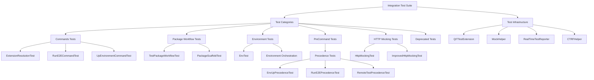
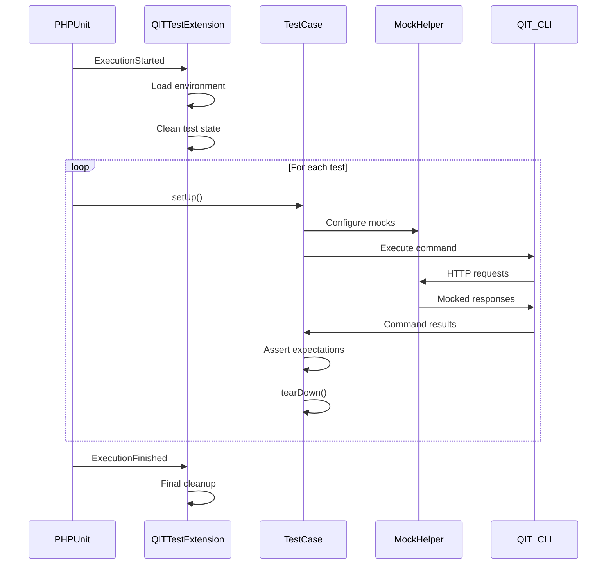
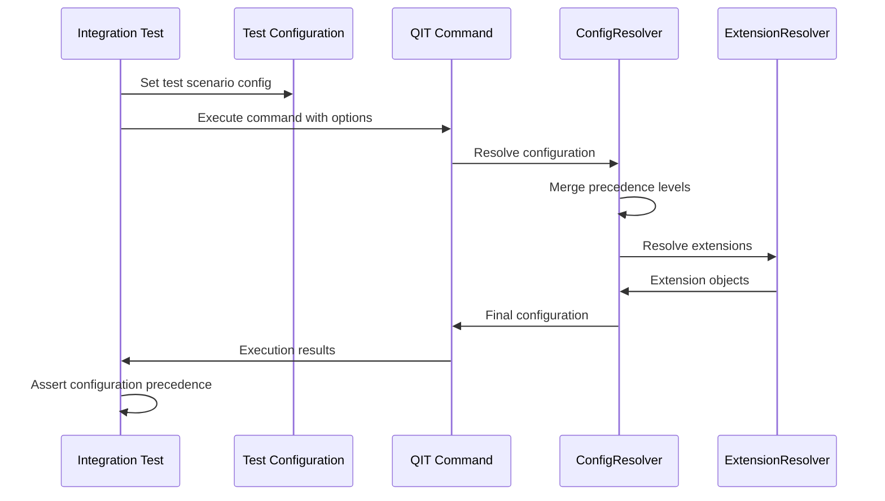

# QIT Integration Test Suite

## Overview

The QIT Integration Test Suite provides comprehensive end-to-end testing of QIT CLI functionality, including command execution, configuration resolution, extension management, test package workflows, and environment orchestration. This test suite ensures QIT's complex interactions work correctly across different scenarios and configurations.

## Architecture



## Test Infrastructure

### 1. QITTestExtension (`QITTestExtension.php`)
**Purpose**: PHPUnit extension providing QIT-specific test setup and teardown.

**Key Features**:
- **Environment Management**: Test environment setup and cleanup
- **Configuration Loading**: Loads test-specific environment variables
- **Test State Management**: Manages test isolation and state
- **Cleanup Operations**: Ensures clean test environment between runs

**Lifecycle Hooks**:
- **ExecutionStarted**: Initialize test environment, load dotenv configuration
- **ExecutionFinished**: Clean up test artifacts and resources

### 2. MockHelper (`MockHelper.php`)
**Purpose**: HTTP request mocking and API simulation for testing.

**Key Features**:
- **API Mocking**: Simulates QIT Manager API responses
- **Request Interception**: Captures and validates HTTP requests
- **Response Simulation**: Provides realistic API response data
- **Test Isolation**: Prevents tests from making actual HTTP requests

### 3. RealTimeTestReporter (`RealTimeTestReporter.php`)
**Purpose**: Real-time test execution reporting and progress tracking.

**Key Features**:
- **Progress Tracking**: Real-time test execution updates
- **Result Aggregation**: Collects and formats test results
- **Performance Metrics**: Tracks test execution timing
- **Failure Analysis**: Detailed failure reporting and context

### 4. CTRFHelper (`CTRFHelper.php`)
**Purpose**: Common Test Result Format validation and manipulation.

**Key Features**:
- **CTRF Validation**: Validates test results against CTRF schema
- **Result Merging**: Combines multiple test result files
- **Format Conversion**: Converts between different result formats
- **Metadata Enrichment**: Adds test context to results

## Test Categories

### 1. Commands Tests (`tests/Commands/`)

#### ExtensionResolutionTest (`ExtensionResolutionTest.php`)
**Purpose**: Tests extension resolution, caching, and dependency management.

**Test Scenarios**:
- Extension source resolution (wporg, wccom, local, URL)
- Cache-first resolution strategies
- Dependency tree resolution
- Version constraint satisfaction
- Error handling for invalid extensions

#### RunE2ECommandTest (`RunE2ECommandTest.php`)
**Purpose**: Tests E2E command execution, configuration merging, and test orchestration.

**Test Scenarios**:
- Command option processing
- Configuration file integration
- Test package resolution
- Environment setup and teardown
- Result collection and validation

#### UpEnvironmentCommandTest (`UpEnvironmentCommandTest.php`)
**Purpose**: Tests environment creation, Docker integration, and resource management.

**Test Scenarios**:
- Docker environment initialization
- Extension installation in environments
- Environment variable distribution
- Volume mapping and network configuration
- Environment state management

### 2. Package Workflow Tests (`tests/Packages/`)

#### TestPackageWorkflowTest (`TestPackageWorkflowTest.php`)
**Purpose**: End-to-end test package lifecycle testing.

**Test Scenarios**:
- **TP001-TP050+**: Comprehensive workflow testing
- Package scaffolding and creation
- Publication to registry
- Download and caching
- Execution in environments
- Result collection and CTRF validation

**Key Test Cases**:
- `tp004_multiple_test_packages_same_run`: Multiple package orchestration
- `tp008_ctrf_merging_multiple_packages`: Result aggregation testing
- Subpackage inheritance and overrides
- Network requirement handling
- Global setup/teardown coordination

#### PackageScaffoldTest (`PackageScaffoldTest.php`)
**Purpose**: Test package scaffolding functionality.

**Test Scenarios**:
- Package structure generation
- Template customization
- Configuration file creation
- Dependency declaration
- Validation rule enforcement

### 3. Environment Tests (`tests/EnvTest.php`)

**Purpose**: Environment management, Docker integration, and resource coordination.

**Test Scenarios**:
- Environment lifecycle (up, down, reset)
- Extension installation and activation
- Environment variable handling
- Resource cleanup and management
- Multi-environment coordination

### 4. PreCommand Tests (`tests/PreCommand/`)

#### EnvUpPrecedenceTest (`EnvUpPrecedenceTest.php`)
**Purpose**: Configuration precedence and merging for environment commands.

**Test Scenarios**:
- CLI override precedence
- Profile configuration merging
- Environment variable resolution
- Extension array merging
- Volume mapping precedence

#### RunE2EPrecedenceTest (`RunE2EPrecedenceTest.php`)
**Purpose**: Configuration precedence for E2E test execution.

**Test Scenarios**:
- Test configuration merging
- SUT override handling
- Profile precedence chains
- Environment variable precedence
- Extension dependency resolution

#### RemoteTestPrecedenceTest (`RemoteTestPrecedenceTest.php`)
**Purpose**: Configuration precedence for remote test execution.

**Test Scenarios**:
- Remote test type configuration
- SUT resolution for remote tests
- Version option handling
- Test-specific option precedence
- Upload option processing

### 5. HTTP Mocking Tests (`tests/HttpMockingTest.php`, `tests/ImprovedHttpMockingTest.php`)

**Purpose**: HTTP request mocking, API simulation, and network isolation.

**Test Scenarios**:
- Request interception and validation
- API response simulation
- Network isolation testing
- Error condition simulation
- Rate limiting simulation

## Test Fixtures and Data

### Test Packages (`fixtures/test-packages/`)

**Available Test Packages**:
- `regular-test-package-one/two`: Standard test packages
- `orchestration-test-package-1/2`: Complex orchestration scenarios
- `failing-test-package`: Failure handling testing
- `global-setup-test-package`: Global setup/teardown testing
- `network-test-package`: Network requirement testing
- `subpackages-parent/override`: Package inheritance testing
- `passthrough-local/remote`: Passthrough execution testing

### Test Artifacts (`data/`)

**Plugin Artifacts**:
- `plugins/valid/`: Valid plugin archives for testing
- `plugins/invalid/`: Invalid plugins for error testing
- `themes/valid/`: Valid theme archives
- `themes/invalid/`: Invalid themes for error testing

**Test Data**:
- Configuration files for different scenarios
- Environment variable files
- Mock API response data
- Expected result snapshots

## Test Execution Flow

### Integration Test Lifecycle


### Configuration Testing Flow


## Test Data Management

### Snapshot Testing
- **Test Snapshots**: Expected output validation
- **Configuration Snapshots**: Complex config resolution validation
- **Result Snapshots**: CTRF and result format validation
- **Snapshot Updates**: Automated snapshot regeneration

### Environment Variables
```bash
# Test-specific environment variables
QIT_TEST_MODE=true
QIT_MOCK_HTTP=true
QIT_TEST_CACHE_DIR=/tmp/qit-test-cache
QIT_TEST_REGISTRY_URL=http://localhost:mock
```

### Mock API Responses
- **Extension Metadata**: wporg/wccom API responses
- **Test Package Registry**: Package listing and download responses
- **Manager API**: Test execution and result responses
- **Error Scenarios**: Various failure condition responses

## Advanced Testing Features

### 1. Test Package Orchestration
Complex test scenarios with multiple test packages:
- Parallel package execution
- Package dependency resolution
- Global setup coordination
- Result aggregation validation

### 2. Configuration Precedence Testing
Comprehensive precedence validation:
- CLI options override profiles
- Profiles override base configuration
- Environment variables and files
- Array merging and deduplication

### 3. Extension Resolution Testing
Complex extension scenarios:
- Multi-source extension resolution
- Cache-first resolution validation
- Dependency tree complexity
- Version constraint satisfaction

### 4. HTTP Mocking Strategies
Sophisticated API simulation:
- Request pattern matching
- Response templating
- Error condition simulation
- Network timeout scenarios

## Test Coverage Analysis

The integration test suite provides coverage for:

**Configuration System** (95%+):
- JSON schema validation
- Configuration merging and precedence
- Profile inheritance
- Extension declaration processing

**Extension Resolution** (90%+):
- Source detection and resolution
- Cache management and validation
- Dependency tree resolution
- Version constraint handling

**Test Package System** (85%+):
- Package lifecycle workflows
- Registry integration
- Manifest validation
- Execution orchestration

**Environment Management** (80%+):
- Docker integration
- Resource management
- State coordination
- Cleanup operations

## Running Integration Tests

### Full Test Suite
```bash
cd src/tests/integration
./vendor/bin/phpunit
```

### Specific Test Categories
```bash
# Commands tests only
./vendor/bin/phpunit tests/Commands/

# Package workflow tests
./vendor/bin/phpunit tests/Packages/

# Precedence tests
./vendor/bin/phpunit tests/PreCommand/
```

### Test Development

#### Adding New Tests
1. Create test class extending appropriate base class
2. Add test fixtures and data files
3. Configure mocks for external dependencies
4. Implement test scenarios with assertions
5. Add snapshots for expected outputs

#### Mock Configuration
```php
MockHelper::mockHttpRequest(
    'GET',
    'https://api.wordpress.org/plugins/info/1.0/plugin-name.json',
    ['mock' => 'response', 'data' => 'here']
);
```

## Future Enhancements

1. **Performance Testing**: Integration with performance benchmarks
2. **Parallel Test Execution**: Concurrent test suite execution
3. **Visual Test Reporting**: Rich HTML test reports
4. **Automated Regression Testing**: CI/CD integration
5. **Test Data Generation**: Dynamic test data creation

## Test Quality Metrics

- **Coverage**: 85%+ across all major components
- **Execution Time**: Full suite under 10 minutes
- **Reliability**: 99%+ test pass rate
- **Maintainability**: Clear test documentation and organization
- **Isolation**: No test dependencies or shared state